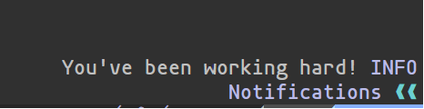

## take-a-break.nvim

# Introduction 

This plugin is to have the user take a break every 30 minutes by having 
a message display in the bottom right. 

# Requirements

- **Neovim 0.9 or later**

# Installation 

You can install take-a-break with your favorite plugin manager. 

    
    {
    "Edret0/take-a-break.nvim",
    dependencies = {"j-hui/fidget.nvim"}
    }
    

# Configuration

    require("take-a-break").setup()
    

